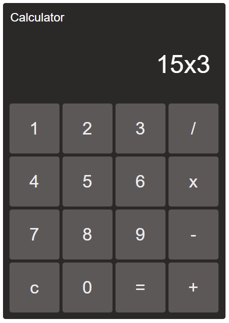

# Simple Calculator using HTML

Simple Calculator demo project.


<br />
<br />

# Available Scripts

In the project directory, you can run:

## Installation

```cmd
yarn
```

## Launch

Runs the app in the development mode and, <br>
automatically opens the app at the address [http://127.0.0.1:4455](http://127.0.0.1:4455) in the browser.

```cmd
yarn start
```
